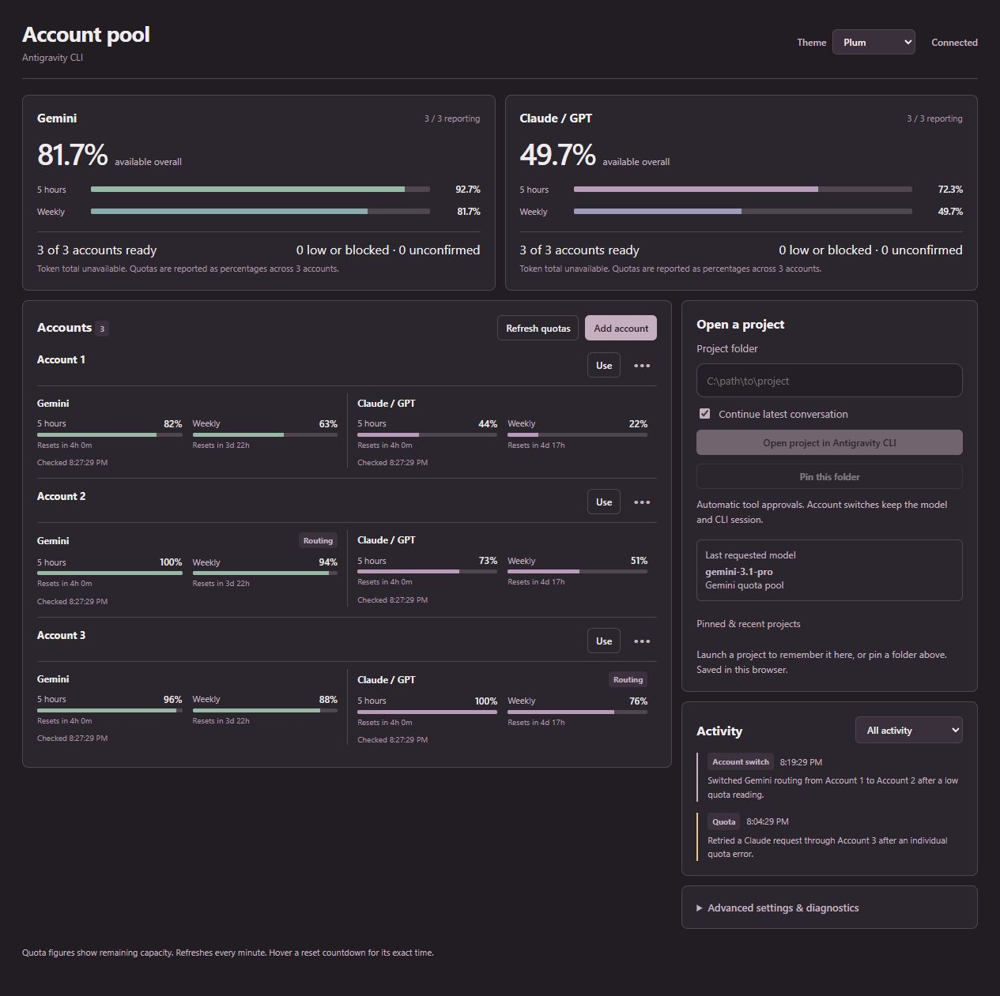
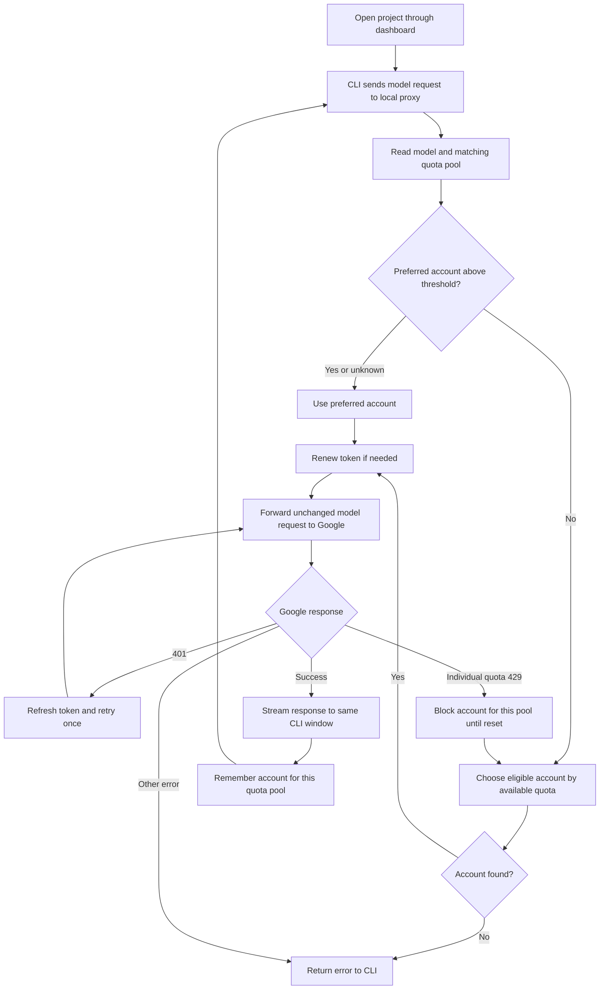
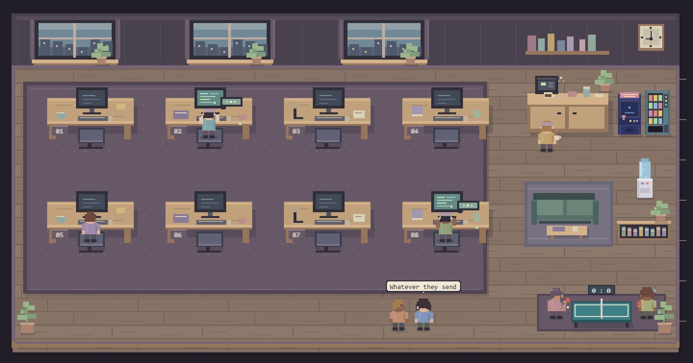

# Antigravity Account Pool

Use several Google accounts with one Antigravity CLI project window. The pool checks the quota for the model used by each request and routes eligible requests through another signed-in account when the current one runs low. You keep the same project folder, CLI process, and selected model.

The app runs on your Windows computer. Its dashboard, request proxy, and account credentials stay local. It has no npm dependencies.



> The screenshot uses demo account names and sample quota readings. Your real readings come from your signed-in accounts.

## Why use it?

Antigravity CLI normally signs in to one Google account. When that account reaches a five-hour or weekly model quota, switching accounts by hand interrupts the work. This app lets you enroll multiple accounts once, then checks their quotas for each model request. If another account has room, the next request uses that account without closing the CLI. A quota error detected before the response starts can also be retried through another account.

The two quota pools are independent: **Gemini** and **Claude/GPT**. Each has a five-hour and a weekly reading. A Gemini request is evaluated against Gemini quota; a Claude or GPT request is evaluated against Claude/GPT quota. Switching accounts does not change the model chosen inside `agy`.

## How it works

1. You sign in to Antigravity CLI once. On its first run, the pool copies that credential to a separate entry in your Windows Credential Manager.
2. **Add account** opens an ordinary `agy` login window for another Google account. The pool saves the new credential separately and restores the original CLI credential. Repeat for the accounts you want to use.
3. **Open project in Antigravity CLI** starts `agy` in your project folder with `CLOUD_CODE_URL` pointed at the pool on `127.0.0.1:18454`. The launcher includes `--dangerously-skip-permissions` for project sessions. Account login windows do not use that option.
4. Before a generation request, the pool reads its model ID, checks that model's relevant quota windows, and selects an eligible account. The lower of the five-hour and weekly remaining percentages determines whether the account is above the configured switch threshold (10% by default).
5. The proxy sends the original request, including its model and body, to Google's Antigravity endpoint with the selected account's access token. If Google returns an individual-quota 429 before output begins, it marks that account blocked for the relevant quota pool until reset and tries another available account.
6. The response streams back into the **same CLI window**. Subsequent requests prefer the last successful account for that quota pool. Access tokens are renewed when needed.



The fallback step may select an account whose quota could not be measured, or the account with the highest known remaining quota even if it is below the threshold. If quota readings are unknown for the preferred account, the pool keeps using it until Google responds or a later reading becomes available. The quota retry applies to an individual-quota response **before model output begins**; an already streaming response cannot be replayed safely.

## Requirements

- Windows with Antigravity CLI (`agy`) installed and signed in to your first account.
- PowerShell 7 and Node.js 20 or newer available on your computer.
- At least two Google accounts to enable switching. Their model access and quotas may differ.

## Install

Download the repository ZIP from GitHub and extract it to a folder you control, or clone the repository. Review the scripts before running them; installation does not download or run third-party packages.

Open PowerShell 7 **as your normal Windows user** in the extracted repository folder and run:

```powershell
pwsh -NoProfile -ExecutionPolicy Bypass -File .\Install-Then-Open.ps1
```

The installer copies the app to `%LOCALAPPDATA%\AntigravityAccountPool`, creates an **Antigravity Account Pool** Desktop shortcut, and opens the dashboard in your default browser. The shortcut uses the included custom icon from `assets/account-pool-v1.ico`. Double-click that shortcut for future launches; the browser window may be closed while the pool continues running. The notification-area icon can reopen the dashboard or stop the pool.

The Desktop icon is included as both `.ico` and `.png` under `assets/`. It was generated for this project; the installer uses the `.ico` file automatically.

The dashboard is served only at [http://127.0.0.1:18454/](http://127.0.0.1:18454/). If installation cannot find `agy`, PowerShell 7, or Node.js, check that each is installed and available from a new PowerShell window.

### Add accounts and open a project

1. Click **Add account**, then sign in to a *different* Google account in the `agy` login window. Wait for its card to appear before adding another account.
2. Repeat as needed. You can rename or remove accounts on their cards. At least one account must stay in the pool.
3. Enter an existing project folder in the dashboard and click **Open project in Antigravity CLI**. You can choose whether to continue the latest project conversation.
4. Select a model inside the CLI and work normally. Keep the pool running while the CLI uses it.

The **Theme** menu has six choices. **Plum** is the default for a new browser; your selection is remembered in that browser.

## Reading the dashboard

The top Gemini and Claude/GPT summaries show percentages on a **0–100% scale regardless of account count**. Each has separate five-hour and weekly bars. The main number averages the lower window from accounts with current readings, counting quota-blocked accounts as 0% usable. Reporting counts show how many accounts have current readings; missing or stale readings are unconfirmed.

Every account also has its own five-hour and weekly bars for both quota pools. Reset countdowns are shown when Google provides a reset time. **Refresh quotas** requests new readings immediately; the pool otherwise refreshes them periodically. The **Routing** label identifies the account preferred for that pool's next request. The login name displayed by `agy` may still be the original account because routing happens inside the local proxy.

**The office** is one shared pixel-art room that grows into rows as you add accounts.



Each saved account has one character and a matching name in the roster. A character moves to its desk and types while that account has a model request in flight; it says "On it!" when a request starts and celebrates when it finishes. It shows as recently active for a few seconds afterward. A character whose account has low or blocked quota looks tired.

Everything else is **decorative break-time play**: characters fetch coffee from an animated coffee machine, play ping-pong or the arcade cabinet, grab snacks, use the water cooler, nap on the sofa, read, water the plants, visit busy colleagues, and chat in speech bubbles. Click a character, the coffee machine, the ping-pong table, or another prop, or use the **Coffee run**, **Ping-pong**, **Arcade**, and **Chat** buttons, to start an activity. **Chat: on/off** hides speech bubbles. Characters only take breaks while they are idle, and only a real model request ever makes one show as working. These characters visualize routing activity and do not launch independent coding agents. The room respects your theme choice and reduced-motion setting, and **Pause motion** freezes the room while live status keeps updating.

These are **remaining quota percentages, not token counts**. Google's quota response does not provide an absolute token allowance, so the app cannot compute a trustworthy combined token total.

## Limits and privacy

- [Google Antigravity's current Additional Terms](https://antigravity.google/terms) restrict third-party tools that access the service and warn of possible account suspension or termination. This app's local proxy forwards requests with account credentials, so its use may conflict with those terms. Review them and seek Google's permission before using or distributing the routing feature.
- Early switching depends on quota readings that Google can change or delay. A 429 before output starts is the fallback. Neither path guarantees that every long-running turn will finish without interruption.
- If all accounts are exhausted or the selected model is unavailable to the next account, the CLI receives Google's error. The pool does not switch models for you.
- Only CLI sessions opened through this dashboard use the proxy. An existing `agy` process started elsewhere has no local proxy URL.
- The proxy listens on `127.0.0.1` and forwards Antigravity Cloud Code requests to Google's service. Prompt and response bodies are not written to app logs. The dashboard uses a per-run request key for actions that change state.
- Account credentials are stored as separate entries in **Windows Credential Manager**. `data/accounts.json` holds account labels, emails, threshold, block times, and recent events; it contains no OAuth tokens. Do not publish your local `data` folder or credential exports.
- Token renewal uses the OAuth client bundled with your installed `agy.exe`. The repository does not include that client value or your account tokens. If AGY is installed elsewhere, set `AGY_POOL_AGY_PATH` to its executable. A future AGY version may change its OAuth client; if it does, token renewal will show an error until this tool is updated or both `AGY_POOL_OAUTH_CLIENT_ID` and `AGY_POOL_OAUTH_CLIENT_SECRET` are supplied locally.
- Project windows use `--dangerously-skip-permissions`, which lets `agy` run tool actions without individual permission prompts. Use the project launcher only for tasks you intend to run with that level of autonomy.

## Verify account switching

Send a small prompt in the project CLI so the pool sees the selected model. In **Advanced settings & diagnostics**, choose **Test low quota switch**, then send another small prompt in the same CLI. The test treats the preferred account's reading for that model as 0% once and should route through another account. **Test quota error retry** simulates one individual-quota error for that model before output and exercises the retry path. Check the dashboard Activity log for the account used. These tests consume a small amount of the other account's quota.

This is an independent local utility for Antigravity CLI; it is not an official Google product.

Licensed under [MIT](LICENSE).
